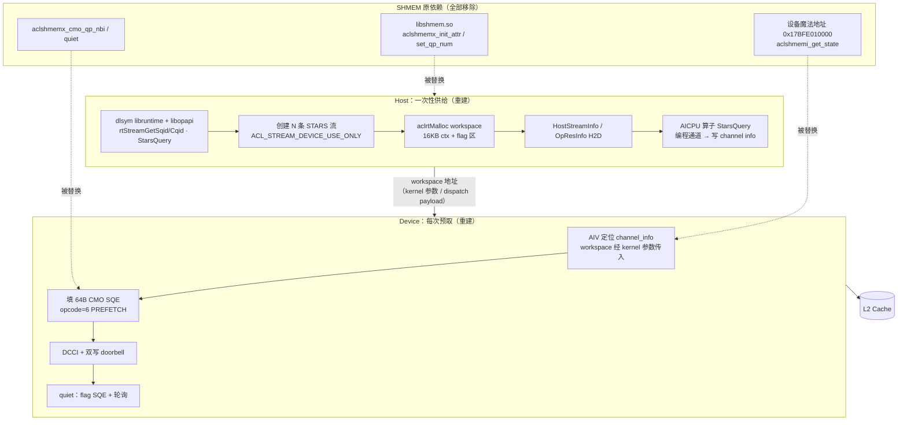
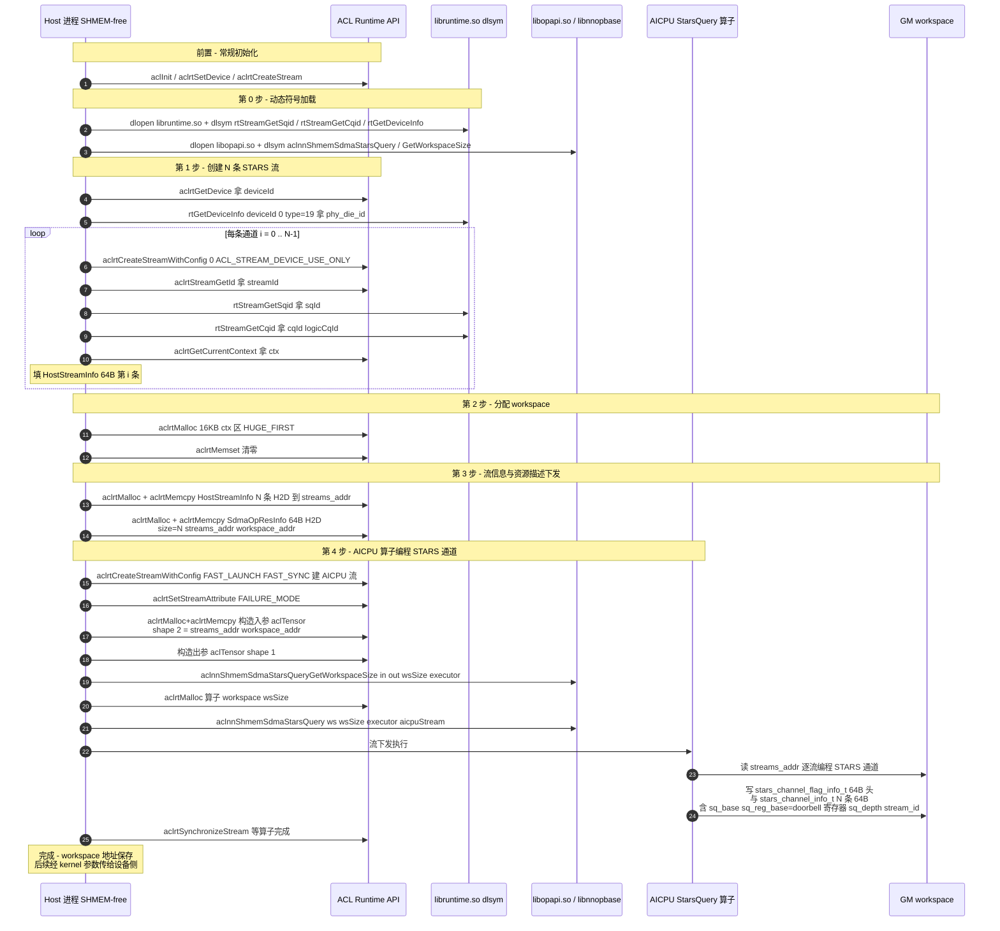
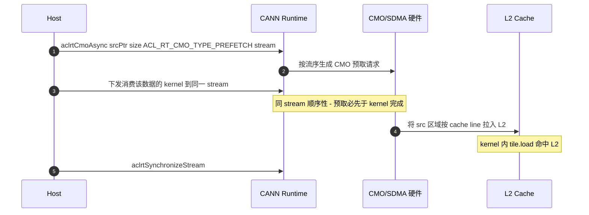
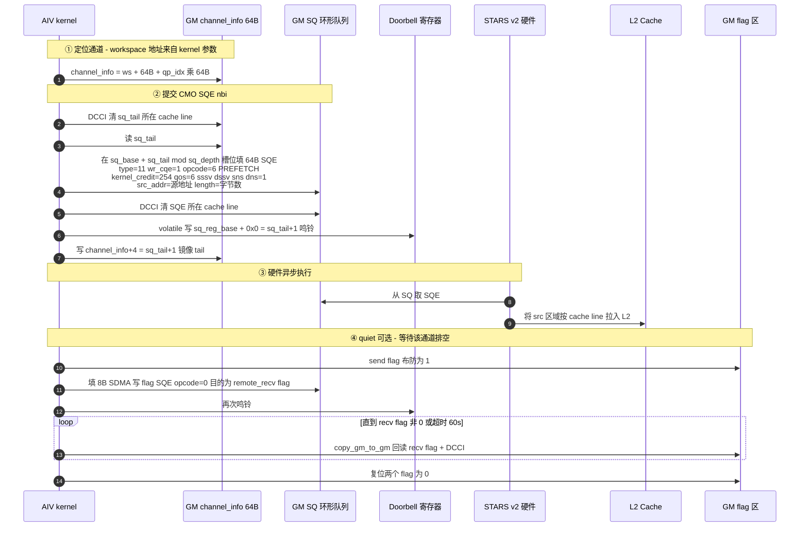
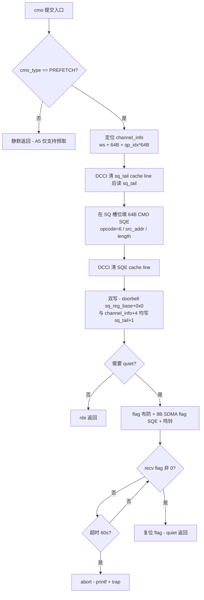

# A5（Ascend950）SHMEM-free CMO 预取最小实现 —— 仅依赖底层 ACL/Runtime 接口

> **状态**：实现指导（最小接口提取）
> **日期**：2026-09-16
> **目标**：完全脱离 `libshmem.so`（不 init SHMEM、不用其对称堆/魔法地址/设备 API），仅依赖
> **ACL Runtime 公开 API + dlsym 私有符号 + AICPU 算子 + 设备侧 ccec/bisheng 编译器原生
> 内置函数**（不依赖 Ascend C API，清单见 `a5-cmo-prefetch-demos.md` §0.1），在 A5 上实现
> GM→L2 的 CMO 预取，并以时序图/流程图展示底层调用链
> **事实来源**：SHMEM master @ 73064fa（PR #459）逐行提取 + pto-isa `SdmaWorkspaceManager`
> （已验证的 SHMEM-free 参考实现，48 流）
> **关联文档**：
> - `a5-shmem-prefetch-extraction.md` —— SHMEM **仓内**实现提取（含 SHMEM API 依赖面，本文的输入）
> - `a5-cmo-prefetch-demos.md` —— 三条链路的**最小可编译 C++ demo 程序**（本文的代码化落地；
>   设备侧零 Ascend C 依赖，仅编译器原生内置函数）
> - `shmem-prefetch-pypto-integration.md` —— PyPTO 前端语义设计（`pl.prefetch.*` / `host_async`）
> - `a5-sdma-prefetch-minimal-guide.md` —— pypto/simpler/pto-isa 三仓使能指南
> - `stars-v2-cmo-direct-drive-guide.md` —— 早期直驱方案（wrapper 注入路线已被正式 IR op 取代，
>   但其中的 SQE/结构体提取仍是本文设备侧的原始出处）

---

## 0. 结论速览

| 问题 | 答案 |
|------|------|
| 脱离 SHMEM 后三条路径还可行吗？ | **全部可行**。路径 A 本来就不依赖 SHMEM；路径 B/C 的"SHMEM 依赖"只有两件事——**host 供给链**（可用 6 个 ACL API + 5 个 dlsym 符号重建）与 **workspace 寻址**（用 kernel 参数传入替代 SHMEM 魔法地址） |
| host 供给链的核心是什么？ | 不是 host 自己编程 doorbell，而是下发 **AICPU 算子 `aclnnShmemSdmaStarsQuery`**（dlsym 自 `libopapi.so`），由它按 STARS 流信息把 channel info（含 doorbell 寄存器地址）写进 workspace |
| 设备侧需要什么？ | 零库依赖（**含不依赖 Ascend C**）：64B SQE 结构体 + 编译器原生内置函数 `dcci` / `copy_ubuf_to_gm_align_v2` + `set_flag`/`wait_flag` / `ld_dev`，门铃经 MTE3 4B 写 |
| 有没有现成参考实现？ | 有：pto-isa `sdma_workspace_manager.hpp`（host 五步，48 流，已随 A5 使能验证编译）+ `sdma_cmo_intrin.hpp`（设备直驱，与 SHMEM 字节级一致） |

---

## 1. 依赖接口总清单（脱离 SHMEM 后的全部外部依赖）

### 1.1 Host 侧 — ACL Runtime 公开 API（直接链接 `libascendcl.so` / `libruntime.so`）

| API | 用途 | 阶段 |
|---|---|---|
| `aclInit` / `aclrtSetDevice` / `aclrtFinalize` / `aclrtResetDevice` | 常规初始化 | 一次性 |
| `aclrtCreateStream` | 普通流（下发 kernel） | 一次性 |
| `aclrtCreateStreamWithConfig(&s, 0, ACL_STREAM_DEVICE_USE_ONLY=0x20)` | **创建 STARS 设备流**（每通道一条，走 SDMA 引擎） | 供给链 |
| `aclrtStreamGetId(s, &streamId)` | 取流 ID（填 `HostStreamInfo`） | 供给链 |
| `aclrtGetCurrentContext(&ctx)` | 取当前 context（填 `HostStreamInfo`） | 供给链 |
| `aclrtCreateStreamWithConfig(&s, 0, ACL_STREAM_FAST_LAUNCH\|ACL_STREAM_FAST_SYNC)` | AICPU 算子执行流 | 供给链 |
| `aclrtSetStreamAttribute(s, ACL_STREAM_ATTR_FAILURE_MODE, &v)` | AICPU 流失败模式 | 供给链 |
| `aclrtMalloc(…, ACL_MEM_MALLOC_HUGE_FIRST)` / `aclrtMemset` / `aclrtMemcpy(H2D)` / `aclrtFree` | workspace/流信息下发/算子张量构造 | 供给链 |
| `aclrtSynchronizeStream` | 等 AICPU 算子完成 | 供给链 |
| `aclrtCmoAsync(ptr, size, ACL_RT_CMO_TYPE_PREFETCH, stream)` | **路径 A**：host 流序预取（CANN ≥ 9.1.0） | 运行时 |

### 1.2 Host 侧 — dlsym 动态符号（不在公开头文件中）

| 符号 | 来源库 | 签名要点 | 用途 |
|---|---|---|---|
| `rtStreamGetSqid` | `libruntime.so` | `int(const void* stream, uint32_t* sqId)` | 取流对应的 SQ 队列号 |
| `rtStreamGetCqid` | `libruntime.so` | `int(const void* stream, uint32_t* cqId, uint32_t* logicCqId)` | 取 CQ 队列号 |
| `rtGetDeviceInfo` | `libruntime.so` | `int(uint32_t dev, int32_t, int32_t type, int64_t* out)`；`type=19` = phy_die_id | 取 die ID（填 `HostStreamInfo.dev_id`） |
| `aclnnShmemSdmaStarsQueryGetWorkspaceSize` | `libopapi.so` | `int(aclTensor* in, aclTensor* out, uint64_t* wsSize, aclOpExecutor** executor)` | AICPU 算子一段式（取 executor 与算子 workspace 大小） |
| `aclnnShmemSdmaStarsQuery` | `libopapi.so` | `int(void* ws, uint64_t wsSize, aclOpExecutor*, aclrtStream)` | AICPU 算子二段式（执行：按流信息编程 STARS 通道，写 channel info 进 workspace） |
| `aclCreateTensor` / `aclDestroyTensor` | `libnnopbase.so`（公开头 `aclnn/acl_meta.h`） | — | 构造上述算子的入/出 aclTensor（ACL_UINT64, ND） |

> 自检命令：`nm -D $ASCEND_HOME_PATH/lib64/libopapi.so | grep -i ShmemSdmaStarsQuery`——
> 缺符号即 CANN 版本不满足 9.1.0（供给链会失败，需优雅降级）。

### 1.3 Host 侧 — 私有结构体（需自带定义，与 SHMEM/pto-isa 布局一致）

```cpp
struct HostStreamInfo {              // 64B — 每 STARS 流一条，H2D 交给 AICPU 算子
    uint64_t stream_;                // aclrtStream 句柄
    uint64_t ctx_;                   // aclrtGetCurrentContext
    int32_t  stream_id;              // aclrtStreamGetId
    uint32_t sq_id;                  // rtStreamGetSqid
    uint32_t cq_id;                  // rtStreamGetCqid
    uint32_t logic_cq_id;            // rtStreamGetCqid
    uint64_t cqe_addr;               // （SHMEM 同名字段，AICPU 算子使用）
    int32_t  dev_id;                 // rtGetDeviceInfo(dev, 0, 19) = phy_die_id
    uint8_t  reserved[20];
};
struct SdmaOpResInfo {               // 64B — 算子资源描述，H2D
    uint64_t size;                   // 流数量
    uint64_t streams_addr;           // HostStreamInfo[] 的 GM 地址
    uint64_t workspace_addr;         // workspace 的 GM 地址
    uint8_t  reserved[40];
};
```

### 1.4 设备侧（kernel 内）— 零库依赖，仅编译器原生内置函数（不依赖 Ascend C）

| 原生内置函数 | 用途 |
|---|---|
| `dcci(ptr, SINGLE_CACHE_LINE)` | DCCI：写 SQE 后清 cache line，保证硬件可见（AscendC 等价：`DataCacheCleanAndInvalid`） |
| `copy_ubuf_to_gm_align_v2(gm, ub, 0, 1, size, 0, 0, 0)` + `set_flag`/`wait_flag(PIPE_S↔PIPE_MTE3, EVENT_ID0)` | MTE3 UB→GM 4B 搬运（doorbell 与镜像写、flag 布防；AscendC 等价：`DataCopyPad` + `SetFlag`/`WaitFlag`） |
| `ld_dev(ptr, 0)` / `st_dev(v, ptr, 0)` | 旁路标量 L1 的 GM 读/写（tail/flag 轮询，免 DCCI） |
| `get_block_idx()` / `ASCEND_IS_NOT_AIV` / `trap()` + `cce::printf` | QP 定位 / AIV 门控 / 超时 abort |
| MTE3 4B 写 `sq_reg_base + 0x0` | **Ring Doorbell**（A5/STARS v2 偏移 0x0；A2A3/v1 为 0x8） |
| `__gm__` 地址空间类型 + 64B 结构体 | 直接解释 workspace 与 SQE 布局 |

> 该层由 ccec/bisheng 设备编译**隐式提供，无需包含任何 CANN 头**。已验证先例：pto-isa
> `hns_1825_backend.hpp`（A5 后端，零 CANN 头使用 copy/sync/dcci/ld_dev/st_dev 全套）、
> pto-isa `include/pto/common/debug.h`（零 include 裸用 `trap()`/`cce::printf`）。完整清单
> 与逐项出处见 `a5-cmo-prefetch-demos.md` §0.1。例外：`AscendC::GetSystemCycle()` 属 API
> 层（`kernel_operator_sys_var_intf.h`），纯原生实现改用轮询次数预算。

---

## 2. 总体架构：SHMEM 依赖被替换成什么



**核心替换原则**：SHMEM 的价值只在于把上面两块"胶水"做成了通用库；脱离它之后，
host 侧是一次性的 ~200 行初始化（§3 时序图 1），设备侧是一段 ~150 行的
头文件内联函数（§5），workspace 寻址从"全局魔法地址"改为"kernel 参数直传"。

---

## 3. 时序图 1：Host 供给链（一次性初始化，五步）

这是 `aclshmemx_init_attr(SDMA 引擎)` 内部（`SdmaTransportManager::OpenDevice` 五步）的
SHMEM-free 等价物。参考实现：pto-isa `include/pto/comm/async/sdma/sdma_workspace_manager.hpp`
（`SdmaWorkspaceManager::Init`，48 通道）。



要点：

1. **doorbell 地址是 AICPU 算子查出来写进 workspace 的**——host 全程不需要知道 STARS 寄存器
   地址，这正是脱离 SHMEM 不需要任何私有驱动接口的原因。
2. SHMEM 与 pto-isa 的差异只在规模：SHMEM 默认 72 通道 / 28KB，pto-isa 48 通道 /
   52KB（16KB ctx + 48×512B flag payload + 48×256B signal slots，flag 区布局供其
   `FinishSdmaPost` 事件机制使用）。
3. `HostStreamInfo[]` 与 `SdmaOpResInfo` 的 GM 拷贝**必须**在算子执行前完成（算子按
   `opResInfo.streams_addr` 到 GM 读流表）。
4. 失败要优雅降级（pto-isa 的做法：`Init()` 返回 false → 上层退回无预取模式，错误态卡上
   析构部分资源可能挂死，宁可泄漏）。

---

## 4. 时序图 2：路径 A —— Host 流序预取（零供给链）

本路径只需 §1.1 的常规 API，无供给链、无 workspace。适合"host 已知访问模式"的预热。



> A5 能力边界：`ACL_RT_CMO_TYPE_PREFETCH` 是唯一生效的 CMO 类型；需 CANN ≥ 9.1.0。
> 该 API 是 host 侧专用——这正是 PyPTO 设计 `prefetch.host_async`（orchestration op）时的
> 落地目标（见集成设计文档 §5.5 变体 V1）。

---

## 5. 时序图 3：路径 B/C —— 设备侧直驱提交与 quiet

设备侧零库依赖（仅编译器原生内置函数，见 §1.4）。`qp_idx` 取 `get_block_idx()`
（路径 C，每 AIV 独立通道；SHMEM 写作 `AscendC::GetBlockIdx()`）；单 AIV kernel 中
恒为 0（即路径 B）。参考实现：pto-isa `sdma_cmo_intrin.hpp` 的 `AddOneCmoSqe`（与 SHMEM
`aclshmemi_fill_stars_v2_cmo_sqe` 字节级一致）。



设备侧提交状态机（流程图）：



### 5.1 设备侧最小代码骨架（SHMEM-free 版，channel 地址经参数传入）

```cpp
// ---- 常量与结构（自带，见 §6 布局） ----
constexpr uint8_t  kSqeTypeSdma        = 11;
constexpr uint8_t  kSqeTypeNotifyRec   = 6;
constexpr uint8_t  kCmoPrefetchOpcode  = 6;      // ACL_RT_CMO_TYPE_PREFETCH
constexpr uint8_t  kKernelCredit       = 254;    // STARS v2 (A5)
constexpr uint32_t kDoorbellOffset     = 0x0;    // STARS v2 (A5; v1/A2A3 为 0x8)

// ---- workspace 解析（替代 aclshmemi_get_state）----
// ws = host 供给链返回的 workspace 地址，经 kernel 参数传入
__gm__ stars_channel_info_t* channel_at(__gm__ uint8_t* ws, uint32_t qp_idx) {
    return reinterpret_cast<__gm__ stars_channel_info_t*>(ws + 64 /*跳过 flag_info 头*/)
           + qp_idx;
}

// ---- 4B GM 写（doorbell 镜像 / flag 布防的基础；MTE3 旁路 AIV 数据 cache）----
static __aicore__ inline void store_u32_gm(__gm__ uint32_t* dst, uint32_t v,
                                           __ubuf__ uint8_t* scratch /*64B 对齐*/) {
    __ubuf__ uint32_t* tmp = reinterpret_cast<__ubuf__ uint32_t*>(scratch);
    *tmp = v;
    set_flag(PIPE_S, PIPE_MTE3, EVENT_ID0);   // 标量 UB 写先于拷贝
    wait_flag(PIPE_S, PIPE_MTE3, EVENT_ID0);
    copy_ubuf_to_gm_align_v2(dst, tmp, 0, 1, 4, 0, 0, 0);
    set_flag(PIPE_MTE3, PIPE_S, EVENT_ID0);   // 拷贝先于后续标量操作
    wait_flag(PIPE_MTE3, PIPE_S, EVENT_ID0);
}

// ---- 单次 CMO 预取提交（nbi）----
static __aicore__ inline void cmo_prefetch_nbi(
    __gm__ uint8_t* ws, __gm__ uint8_t* src, uint32_t bytes,
    uint32_t qp_idx, __ubuf__ uint8_t* scratch /*64B 对齐, >=64B*/)
{
    __gm__ stars_channel_info_t* ci = channel_at(ws, qp_idx);
    // 1. 读 tail / head（ld_dev 旁路标量 L1，无需 DCCI）
    uint32_t sq_tail = ld_dev(reinterpret_cast<__gm__ uint32_t*>(reinterpret_cast<__gm__ uint8_t*>(ci) + 4), 0);
    const uint32_t sq_head = ld_dev(reinterpret_cast<__gm__ uint32_t*>(ci), 0);
    // 2. 填 64B SQE（全字段初始化，布局见 §6.2；res 字段必须清零）
    __gm__ stars_v2_sdma_cmo_sqe_t* sqe =
        reinterpret_cast<__gm__ stars_v2_sdma_cmo_sqe_t*>(ci->sq_base) + (sq_tail % ci->sq_depth);
    *sqe = {};                                          // ★ A5 上必须显式清零（已修复的坑）
    sqe->header.type = kSqeTypeSdma;
    sqe->header.wr_cqe = 1;
    sqe->header.rt_streamid = static_cast<uint16_t>(ci->stream_id);
    sqe->header.task_id = static_cast<uint16_t>(sq_tail - sq_head);
    sqe->kernel_credit = kKernelCredit;
    sqe->opcode = kCmoPrefetchOpcode;
    sqe->sssv = sqe->dssv = sqe->sns = sqe->dns = 1;
    sqe->qos = 6;                                       // HCCL QoS
    sqe->src_addr_low  = static_cast<uint32_t>(reinterpret_cast<uint64_t>(src));
    sqe->src_addr_high = static_cast<uint32_t>(reinterpret_cast<uint64_t>(src) >> 32);
    sqe->length = bytes;
    // 3. DCCI 让 SQE 对硬件可见（逐 64B 行清理并失效）
    for (uint32_t off = 0; off < sizeof(*sqe); off += 64) {
        dcci(reinterpret_cast<__gm__ void*>(reinterpret_cast<__gm__ uint8_t*>(sqe) + off), SINGLE_CACHE_LINE);
    }
    // 4. 鸣铃 + 镜像 tail
    sq_tail = (sq_tail + 1) % ci->sq_depth;
    store_u32_gm(reinterpret_cast<__gm__ uint32_t*>(ci->sq_reg_base + kDoorbellOffset), sq_tail, scratch);
    store_u32_gm(reinterpret_cast<__gm__ uint32_t*>(reinterpret_cast<__gm__ uint8_t*>(ci) + 4), sq_tail, scratch);
}
```

> quiet（flag SQE + 轮询）骨架相同：多一次 8B SDMA 写 flag 的 SQE（`opcode=0`，复用 64B v2
> 布局）+ `ld_dev` 低字轮询（旁路标量 L1）+ 超时路径 `cce::printf` + `trap()`（均为编译器
> 原生内置函数，pto-isa `debug.h` 零 include 先例）。SHMEM 用 `GetSystemCycle()` 60 s 周期
> 限额计时（A5：1000 cycles/µs），但该函数属 Ascend C API 层，纯原生实现改用轮询次数预算。
> 完整字段级实现直接参考 pto-isa `sdma_cmo_intrin.hpp` / `sdma_async_intrin.hpp`——
> 二者已与 SHMEM 做过字节级比对。

---

## 6. GM workspace 布局（设备侧视角）

```
workspace（host aclrtMalloc，供给链第 2 步；AICPU 算子第 4 步填充头部）
  │
  ├── +0x0000  stars_channel_flag_info_t        64B   flag, totalQueueNum=N
  ├── +0x0040  stars_channel_info_t[N]          64B/条
  │              sq_head+0  sq_tail+4  sq_base+8(GM SQ 基址)
  │              sq_reg_base+16(doorbell 寄存器地址)  sq_depth+24
  │              sq_id+28  cq_id+32  logic_cq_id+36  cqe_addr+40
  │              report_cqe_num+48  stream_id+52  dev_id+56
  ├── ……（SHMEM 28KB 版：notify_ids[72] @14KB + 3×N×64B flag 区；
  │        pto-isa 52KB 版：48×512B flag payload + 48×256B signal slots）
  └── SQ 环形队列本体：每通道 sq_depth × 64B（sq_base 指向，地址由 AICPU 算子分配/登记）
```

**关键点**：`sq_base`（SQ 队列本体）与 `sq_reg_base`（doorbell 寄存器）的值都由 AICPU
`StarsQuery` 算子写入——host 与设备侧只消费，不生产；`channel_info.sq_tail` 的镜像写是为了
下次本 AIV 读 tail 不依赖硬件回写（DCCI 后读 GM 即最新值）。

---

## 7. SHMEM 依赖 → SHMEM-free 等价物对照表

| SHMEM 机制 | SHMEM 内实现 | SHMEM-free 等价（本文） |
|---|---|---|
| `aclshmemx_init_attr`（SDMA 引擎供给） | `SdmaTransportManager::OpenDevice` 五步（`device_sdma_transport_manager.cpp:37`） | §3 时序图 1 五步（pto-isa `SdmaWorkspaceManager::Init` 已实现） |
| `aclshmemx_set_qp_num(SDMA, N)` | 全局 QP 数配置（1..72） | 供给链 `CreateStarsStreams(N)` 的 N（构造时定死） |
| 设备找 workspace：魔法地址 `0x17BFE010000` + `aclshmemi_get_state()` | host 把 `device_host_state` 写设备固定 GM 地址 | workspace 地址作为 kernel 参数/dispatch payload 传入（pypto 的 `get_dma_workspace` 即此路线） |
| `aclshmemx_cmo_qp_nbi` / `cmo_nbi` | 设备 API（`shmem_device_sdma.hpp:745/779`） | §5.1 内联 `cmo_prefetch_nbi`（填 SQE + DCCI + 鸣铃） |
| `aclshmemx_sdma_qp_quiet` / `quiet` | 设备 API（`:662/683`） | flag 布防 + 8B SDMA flag SQE + 轮询（§5 时序图 3 ④） |
| `aclshmemx_sdma_qp_notify_record` | 设备 API + host `aclrtWaitAndResetNotify` | 可选：notify-record SQE（type=6）+ host `aclrtCreateNotify/GetNotifyId/WaitAndResetNotify`（公开 API） |
| `aclshmem_barrier_all` / `aclshmem_finalize` | PE 间同步 / 释放 | 单进程不需要；多进程用 stream/event 同步 + §3 资源逆序释放 |
| 对称堆（`local_mem_size`） | SHMEM 分配 | 预取不需要对称性——任意 `aclrtMalloc` 的 GM 地址皆可 |

---

## 8. 环境要求与自检（A5/950）

| 项 | 要求 |
|---|---|
| SoC | Ascend950（`__NPU_ARCH__ == 3510`，ccec 编译 `--cce-aicore-arch=dav-c310`，bisheng `--npu-arch=dav-3510`） |
| HDK 固件 | 25.5.6+ |
| CANN toolkit | **9.1.0+**（9.0.0 无 950 CMO 支持——SDMA workspace 供给与 `aclrtCmoAsync` 同一门槛） |
| ops 包 | cann-950-ops-legacy 9.1.0（`libopapi.so` 含 StarsQuery 符号） |
| 自检 | `nm -D $ASCEND_HOME_PATH/lib64/libopapi.so | grep -i ShmemSdmaStarsQuery` 有输出 |
| 编译标志 | `-mllvm -cce-aicore-dcci-insert-for-scalar=false`（设备侧自管 DCCI 时避免编译器重复插入）；栈 0x8000 |
| A5 硬边界 | CMO 仅 PREFETCH（opcode=6）；SDMA put/get 对外被禁（quiet 的 8B flag 写是内部机制，可用）；CMO 仅 AIV 可执行 |

---

## 9. 已验证参考实现索引（不要重写，直接复用）

| 层 | 位置 | 状态 |
|---|---|---|
| Host 供给链（SHMEM-free） | pto-isa `include/pto/comm/async/sdma/sdma_workspace_manager.hpp`（`SdmaWorkspaceManager`，48 流/52KB，dlsym 全套） | 已实现；simpler `comm_hccl.cpp:dma_workspace_provision` 经其供给，随 A5 使能远程 ccec 编译通过 |
| 设备 CMO 直驱 | pto-isa `include/pto/comm/async/sdma/sdma_cmo_intrin.hpp`（`AddOneCmoSqe` A5 分支，字段与 SHMEM 字节级一致） | 已实现，待 A5 E2E 验证（fork `fix/a5-stars-v2-sqe-init`） |
| 设备会话/quiet | pto-isa `sdma_async_intrin.hpp`（`BuildSdmaSession`，`kAutoChannelGroupIdx`→`get_block_idx()`）+ `TPrefetchAsyncImpl.hpp`（`SubmitCmoPrefetchSqes` 64MB/SQE 拆分） | 同上 |
| workspace→设备传递 | pypto `pto_backend.py`（`_SDMA_WORKSPACE_OPS` / `get_dma_workspace` 注入）+ simpler `DeviceRunnerBase::provision_dma_workspace` | 已合入 main（#2089）+ A5 patch 进行中 |
| 前端语义 | pypto `pl.prefetch.*`（InCore，main #2089）；`prefetch.host_async`（设计稿，见集成设计文档 §5） | 前者已合入；后者 RFC |

---

## 10. 两份"提取"文档的分工（避免混淆）

| 文档 | 回答的问题 | 依赖面 |
|---|---|---|
| `a5-shmem-prefetch-extraction.md` | SHMEM **仓内**是怎么实现的（含其公开 API、示例、构建） | 使用 libshmem |
| **本文** | **不用 SHMEM** 时，同样的能力最少需要哪些底层接口、按什么顺序调用 | 仅 ACL/dlsym/AICPU 算子/编译器原生内置函数 |
